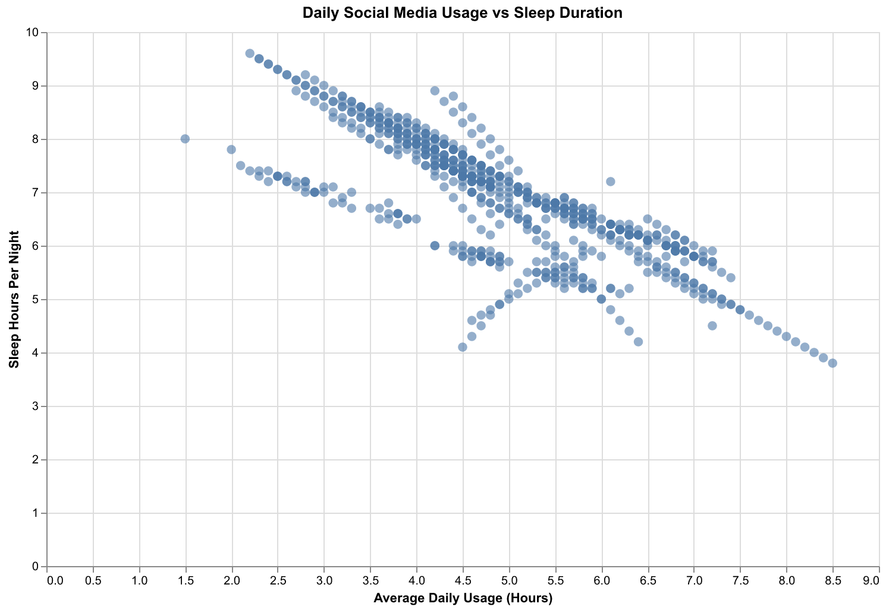
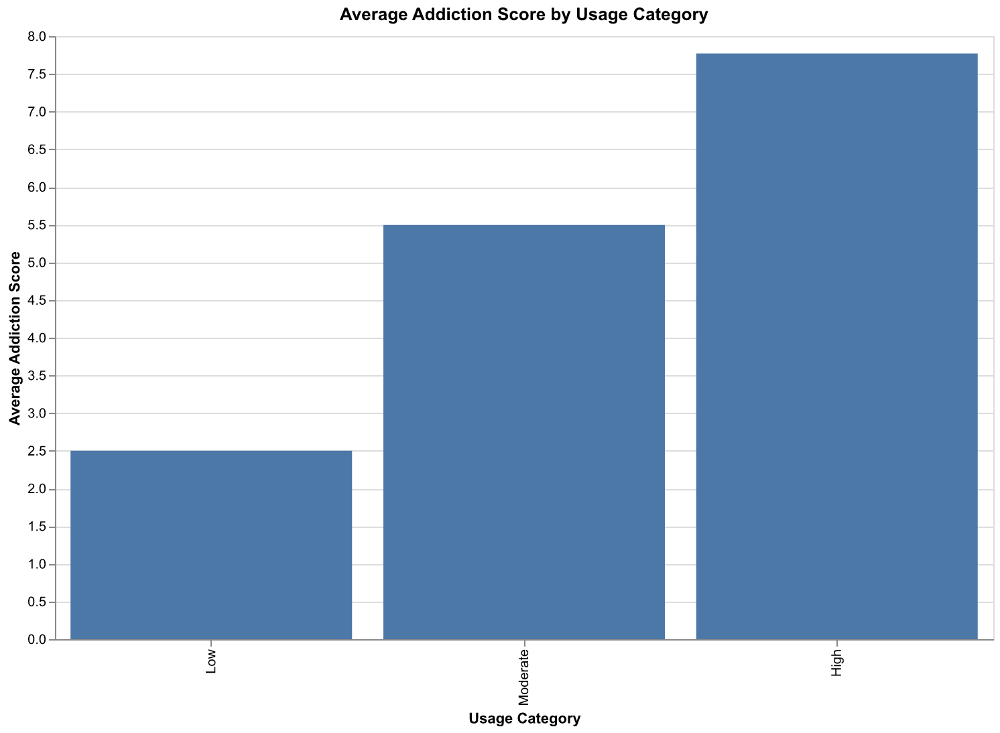

# Proposal Examples

These examples are provided to help you understand the expected depth and style of your proposal. You do not need to follow them exactly, but your sections should cover similar ground. Use the lecture materials to better motivate your proposal.

## Section 1: Motivation and Purpose

> **Our role:** Data scientists. We translate survey responses into meaningful insights that support student well-being.
> **Target audience:** School administrators, counselors, undergraduate students, and graduate students who are affected by or responsible for understanding social medis addicition among students.

> It is no suprise that social media is apart of most people's life, especially undergraduate and graduate students, but how much is too much and how does it affect their well-being and grades? Many undergraduate and graduate students don't realize how the use of social media might affect their mental state and/or academic performance. While students may be struggling with the effect of social media use, school administrators and counselors also need a clear way to explore this information so they can understand what's happening and offer support accordingly. To address this challenge, we propose building a data visualization app that helps our target audience explore patterns/relationships across academic performance, sleep hours, daily social media usage, country, and most used platforms. This allow students to reflect on their own habits while giving school administrators and counselors a clearer picture of which groups may need additional support.

## Section 2: Description of the Data

We use the **Students Social Media Addiction Dataset**, from kaggle which contains structured survey responses capturing students’ demographic characteristics, social media usage behavior, and indicators of addiction.

The dataset contains **705 observations (rows)** and **13 variables (columns)**. Each row represents one individual student’s survey response.

### Key Variables

The variables can be grouped into three major categories:

####  Demographic Variables
- **Age**
- **Gender**
- **Academic_Level**
- **Country**
- **Relationship_Status**

These variables allow us to compare addiction patterns across different student subgroups (e.g., age groups, academic levels, or countries).

---

#### Social Media Usage Behavior
- **Avg_Daily_Usage_Hours** – Average number of hours spent on social media per day.
- **Most_Used_Platform** – Primary platform used (e.g., Instagram, TikTok, etc.).
- **Conflicts_Over_Social_Media** – Whether usage causes interpersonal conflicts.

These variables help measure the intensity and behavioral patterns of social media use.

---

####  Academic & Psychological Impact Indicators
- **Affects_Academic_Performance** – Whether social media impacts studies.
- **Sleep_Hours_Per_Night** – Average sleep duration.
- **Mental_Health_Score** – Numerical indicator of mental well-being.
- **Addicted_Score** – Numerical score quantifying addiction severity.

These variables are central to our problem, as they measure the consequences of excessive social media use on academic performance, sleep quality, and mental health.

---

### Relevance to the Problem

This dataset is highly relevant to our dashboard’s goal of supporting healthier digital behavior among students.

- The **Addicted_Score** provides a measurable indicator of addiction severity.
- **Avg_Daily_Usage_Hours** allows us to examine whether increased usage correlates with higher addiction.
- **Sleep_Hours_Per_Night** and **Mental_Health_Score** help assess psychological and physiological effects.
- **Affects_Academic_Performance** directly connects usage to educational outcomes.

By integrating these variables into an interactive dashboard, users (e.g., educators, counselors, or policymakers) can:

- Identify high-risk student groups.
- Compare addiction levels across demographic categories.
- Explore relationships between screen time, sleep, and mental health.
- Support data-driven interventions for digital well-being.

Because the dataset is clean and tabular, it supports filtering, grouping, and comparative visualizations, making it well-suited for an interactive decision-support dashboard.

## Section 3: Research Questions & Usage Scenarios

### Persona

**Dr. Amina Patel** is a university student wellness coordinator. She is responsible for promoting mental health awareness and identifying behavioral risks among students. She wants data-driven insights to support intervention programs and policy decisions related to digital well-being.

---

### Usage Scenario

Dr. Patel is preparing a mental health awareness campaign focused on digital habits. She wants to understand which groups of students are most vulnerable to social media addiction and how excessive usage impacts sleep, academic performance, and mental health.

Using the dashboard, she filters the data by academic level and gender to explore patterns in addiction scores. She compares average daily usage hours across platforms and investigates whether higher usage correlates with lower sleep hours or mental health scores.

The interactive dashboard allows her to identify high-risk groups and generate evidence-based recommendations for workshops, awareness campaigns, and counseling support initiatives.

---

### Research Questions

The dashboard is designed to help answer the following key questions:

1. How does average daily social media usage relate to addiction levels?
2. Are certain demographic groups (age, gender, academic level) more vulnerable to addiction?
3. Does higher addiction correlate with lower sleep duration or poorer mental health?
4. Do students who report academic performance issues also have higher addiction scores?

---

### User Stories / Jobs To Be Done (JTBD)

**User Story 1**  
As a wellness coordinator, I want to compare addiction scores across different academic levels so that I can identify which groups require targeted intervention.

**User Story 2**  
As a university counselor, I want to examine the relationship between daily usage hours and sleep duration so that I can understand whether excessive social media use is impacting students' rest.

**User Story 3**  
As a policy decision-maker, I want to filter students by platform usage and addiction score so that I can determine whether certain platforms are associated with higher dependency risks.

**User Story 4**  
When preparing a mental health awareness report, I want to visualize how addiction score correlates with mental health score so that I can support evidence-based recommendations.

---

### How Users Will Interact with the App

Users will be able to:

- Filter by age, gender, academic level, and country.
- Select a social media platform to compare addiction patterns.
- Adjust sliders for daily usage hours.
- View summary statistics (average addiction score, average sleep hours).
- Explore interactive charts showing correlations between addiction, sleep, and mental health.

These interactions allow users to move from general exploration to targeted decision-making.

## Section 4: Exploratory Data Analysis

To demonstrate that our dataset can support meaningful decision-making, we focused on the following user story:

> As a university counselor, I want to examine the relationship between daily usage hours and sleep duration so that I can understand whether excessive social media use is impacting students' rest.

We conducted exploratory data analysis in:
`notebooks/eda_analysis.ipynb`

---

### Visualization 1: Social Media Usage vs Sleep Duration

The scatter plot shows **Avg_Daily_Usage_Hours** on the x-axis and **Sleep_Hours_Per_Night** on the y-axis.

The visualization reveals a clear **negative relationship** between usage and sleep duration. As daily social media usage increases, reported sleep hours decrease. Students spending 7–8 hours per day on social media tend to sleep significantly less than those spending 2–3 hours.

This pattern suggests that excessive social media use may contribute to sleep reduction, which is strongly linked to mental health and academic performance outcomes.

---

### Visualization 2: Average Addiction Score by Usage Category

Students were grouped into three usage categories:
- Low (0–2 hours)
- Moderate (2–5 hours)
- High (>5 hours)

The bar chart shows that:

- Low usage students have an average addiction score of approximately **2.5**
- Moderate usage students have an average addiction score of approximately **5.5**
- High usage students have an average addiction score of approximately **7.8**

This demonstrates a strong positive association between time spent on social media and addiction severity.

---

### Decision-Making Implications

These results confirm that the dataset supports our proposed dashboard functionality.

Specifically:

- Increased usage hours are associated with reduced sleep duration.
- Higher usage groups show substantially higher addiction scores.
- The data supports filtering, subgroup comparison, and risk identification.

This evidence demonstrates that the dashboard can help counselors and policymakers identify high-risk behavioral patterns and design targeted digital well-being interventions.

## Section 5: App Sketch & Description

> The app contains a landing page that shows the distribution (depending on data type, bar chart, density chart etc) of dataset factors (hypertension, physical disabilities etc.) colored coded according to whether patients showed up or didn't show up for an appointment. From a dropdown list, users can filter out variables from the distribution display, by patient demographics (i.e. only show female patients), by appointment data (i.e. if SMS was sent), and finally by the date range of appointments. A different dropdown menu will allow users to re-order variables according to the probability of patients being a no-show or in alphabetical order to co-morbidities. Users can compare the distribution of co-morbidities by scrolling down through the app interface.
